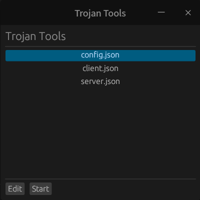

# 介绍
这是一个使用rust egui编写的一个trojan GUI工具，主要目的是方便从桌面直接启动trojan，避免了命令行的烦恼。

# 配置
- 需要自行下载trojan，并将trojan应用程序二进制文件需要满足如下任一要求即可：
    - 放置于环境变量PATH目录之下
    - 放置到trojan-ui的同级目录。
- 配置文件需要是json格式的，并且同样放置在trojan-ui的同级目录下。

下面给出一个可用的配置例子：
```
trojan/
   ├─client.json
   ├─config.json
   ├─server.json
   ├─trojan
   └─trojan-ui
```
配置文件是trojan原生支持的配置文件，该配置文件最终会通过```trojan -c xxx.json```的方式起作用。

# 编译
```
cargo build
```

# 运行
```
./trojan-ui
```
或者双击应用程序运行

# 效果图


# TODO
1. 界面美化
2. json配置文件解析
3. 配置编辑功能
4. 配置添加和删除功能
5. 二维码导入配置功能
6. 通过链接方式导入配置功能(trojan://passwd@url:port#remark)