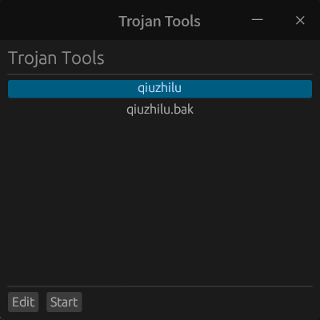

# 介绍
这是一个使用rust egui编写的一个trojan GUI工具，主要目的是方便从桌面直接启动trojan，避免了命令行的烦恼。

# 配置
配置文件需要是json格式的，并且文件名称必须为config.json。
具体路径有如下选择：
- 当前二进制路径/config.json
- $XDG_CONFIG_HOME/trojan_ui/config.json
- $HOME/trojan_ui/config.json
- /etc/trojan_ui/config.json

下面给出一个可用的配置例子：
```
{
    "configs": [
      {
        "remarks": "example",
        "server": "example.com",
        "server_port": 443,
        "client": "127.0.0.1",
        "client_port": 1080,
        "sni": "example.com",
        "password": "dfasidfallljfa",
        "verify": true
      },
      {
        "remarks": "test",
        "server": "test.cn",
        "server_port": 443,
        "client": "127.0.0.1",
        "client_port": 1080,
        "sni": "test.cn",
        "password": "fasdfjlsdfwwer",
        "verify": true
      }
    ]
}
```

# 编译
```
cargo build
```

如果要编译release版本，请使用
```
cargo build -r
```
# 运行
```
./trojan-ui
```
或者双击应用程序运行

# 效果图


# 协议参考
[trojan protocol](https://trojan-gfw.github.io/trojan/protocol)
[socks5 protocol](https://www.rfc-editor.org/rfc/rfc1928)

# TODO
1. 界面美化
2. 配置添加和删除和编辑功能
3. 二维码导入配置功能
4. 添加系统托盘支持